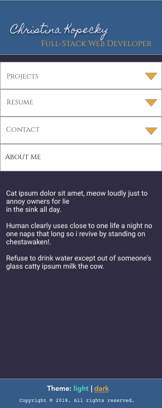
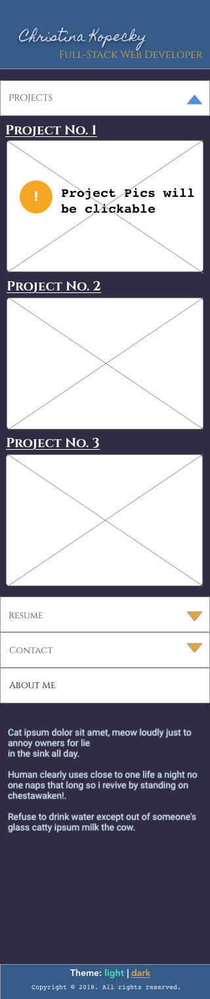
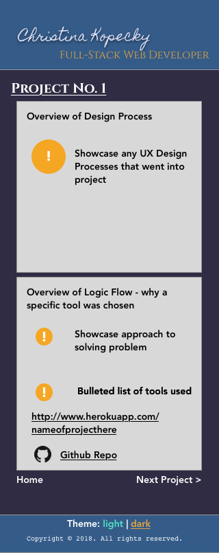
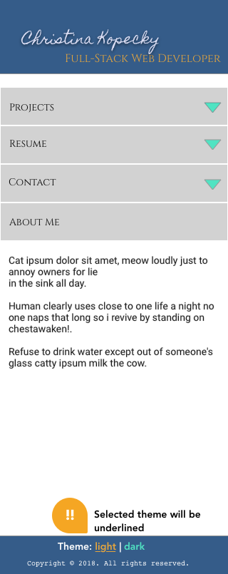

# PortfolioSite

This site started with going through portions the UX Design Process:  Definition, Ideation and Design. 

In my research I took a look at two portfolio sites of a website developer. And while in most cases, heuristics passed, there were things I noticed from a UX standpoint that could stand to be done better:  the mobile breakpoint and how that content is displayed to the user. 

__Definition__:

What is the minimum amount of information needed to get my overall point across? 

* Name
* What I do (or want to do)
* Projects
* Resume
* A way to contact me
* About Me

-- This is what will go in the mobile version. If this is the minimum, we can expand from here for tablet and desktop versions. 

__Sketch__

Using Sketch, I created some wireframes of what I wanted my portfolio to look like:

Mobile Landing Page - Dark Theme:

Mobile Landing Page - Projects Tab Extended - Dark Theme:

Mobile Single Project Page - Dark Theme:

Mobile Landing Page - Light Theme:

--------

I created two themes to handle different times of the day. One for daytime reading and one for nighttime reading. The user can change the theme at the bottom of the page on mobile, or by using a switch a the top of the page on desktop. 

------

## Developing the website:

